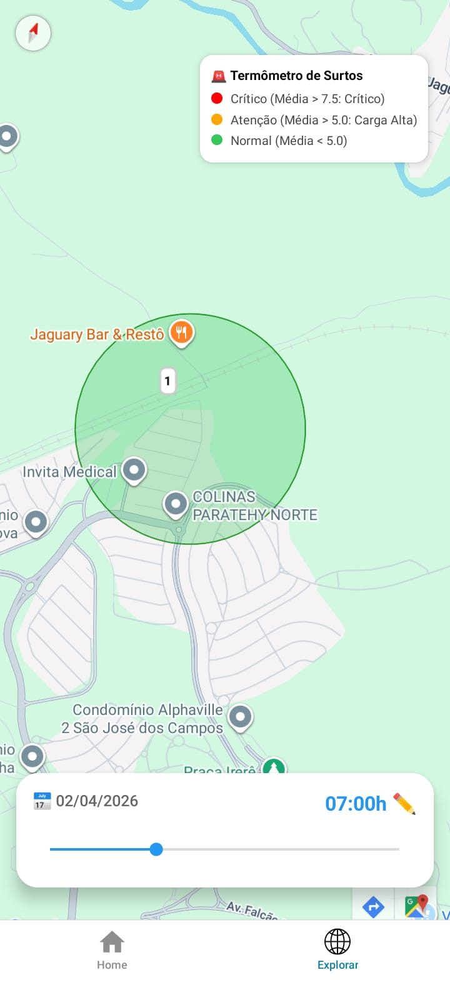
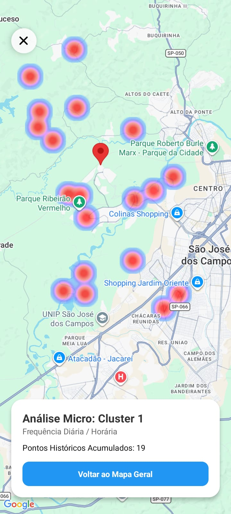

# Previsão de Demanda - Sistema de Inteligência Logística 🚚📍

Este projeto utiliza aprendizado de máquina não supervisionado e análise de séries temporais para antecipar picos de demanda em clusters geográficos. O objetivo principal é otimizar a reposição de estoque e frotas, evitando "surtos" inesperados de pedidos e reduzindo a ociosidade em regiões de baixa demanda.

## 📋 Visão Geral

A solução baseia-se em um dataset histórico de pedidos (+71.000 registros) contendo coordenadas geográficas e carimbo de tempo. O sistema segmenta a cidade em clusters otimizados e prevê o volume de pedidos por hora e dia da semana.

O projeto é dividido em três camadas:

    1. Pipeline de Dados: Processamento, limpeza e clustering (K-Means).

    2. Backend (API): Servidor FastAPI que disponibiliza previsões macro e dados analíticos micro.

    3. Frontend (Mobile): Aplicativo React Native com Mapas de Calor (Heatmaps) e navegação drill-down.

## 🏗️ Documentação de Especificação

O projeto está fundamentado nos seguintes documentos de diretriz técnica (localizados na raiz do projeto):

    PRD.md: Documento de Requisitos do Produto, definindo objetivos, visão de negócio e critérios de aceite.

    ARQUITETURA_SISTEMA.md: Detalhamento da stack tecnológica, fluxo de dados e infraestrutura.

    MODELO_PREDITIVO.md: Especificação estatística, métricas de silhueta e lógica de reescalonamento de criticidade (surtos).

    BACKEND.md: Documentação dos endpoints da API, contratos JSON e lógica de filtros.

    FRONTEND.md: Padrões de UX/UI, guias visuais de cores (Waze style) e componentes React Native utilizados.

## 🚀 Pipeline de Processamento

Para atualizar o modelo com novos dados, o script pipeline_processamento.py executa o seguinte fluxo:

    1. Limpeza e Pré-processamento: Tratamento de nulos e normalização de strings.

    2. Engenharia de Atributos: Extração de hour e day_of_week.

    3. Descoberta do K-Ideal: Utiliza o Método da Silhueta para definir matematicamente o melhor número de regiões geográficas.

    4. Clustering: Aplicação do K-Means e geração da coluna de cluster no dataset original.

    5. Geração de Artefatos:

        dados_analiticos_clusters.csv: Dados brutos para Heatmaps.

        modelo_previsao_demanda_agregado.csv: Médias históricas para performance da API.

        centros_clusters.csv: Coordenadas centrais de cada região.

## 🛠️ Como Executar

### 1. Preparação do Ambiente

Recomenda-se o uso de ambiente virtual (venv):

```
python3 -m venv venv
source venv/bin/activate
pip install -r backend/requirements.txt
```

### 2. Executando o Backend (API)

#### Modo Produção (dados reais):
```
# De dentro da pasta raiz
python3 backend/run.py
```

#### Modo Desenvolvimento (dados de teste):
```
# Para desenvolvimento local, use o parâmetro 'dev'
python3 backend/run.py dev
```

**Importante para desenvolvedores:** 
- Os arquivos CSV de produção (`modelo_previsao_demanda_agregado.csv`, `centros_clusters.csv`, `dados_analiticos_clusters.csv`) não estão incluídos no repositório
- Para desenvolvimento local, use o modo `dev` que automaticamente carrega os arquivos de teste da pasta `backend/test/`
- O pipeline de processamento (`pipeline_processamento.py`) gera os CSVs na pasta `backend/` quando executado com dados reais

A API estará disponível em http://localhost:8000. Você pode testar via Swagger em /docs.

### 3. Executando o Mobile (Expo)

```
cd meu-app-previsao
npx expo start
``` 

Use o app Expo Go no celular para escanear o QR Code.

Certifique-se de que o BASE_URL no arquivo predict.tsx aponta para o IP da sua máquina na rede.


### 🖼️ Visualização do Sistema





## 📊 Níveis de Criticidade

Para evitar a "diluição de médias", o sistema utiliza uma escala de cores baseada em desvios estatísticos:

    🟢 Normal: Médias históricas estáveis (< 5.0 pedidos/h).

    🟠 Atenção: Início de carga elevada (5.0 a 7.5 pedidos/h).

    🔴 CRÍTICO: Risco iminente de surto/explosão de demanda (> 7.5 pedidos/h).